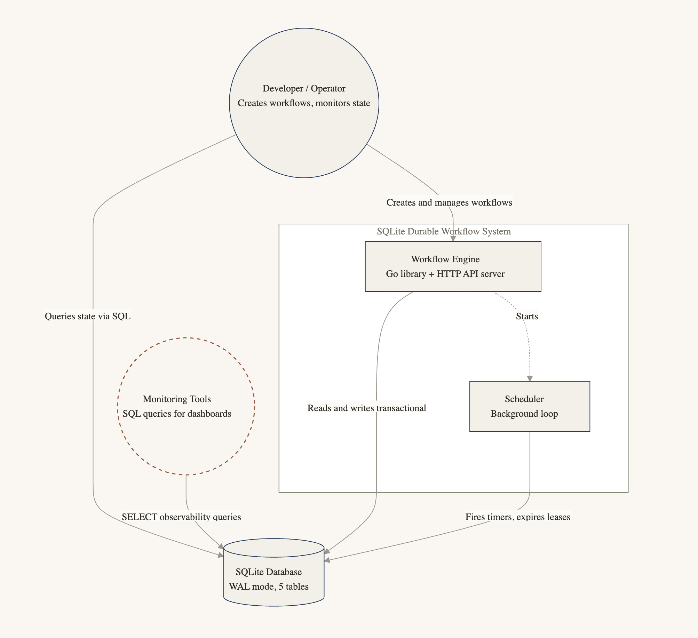
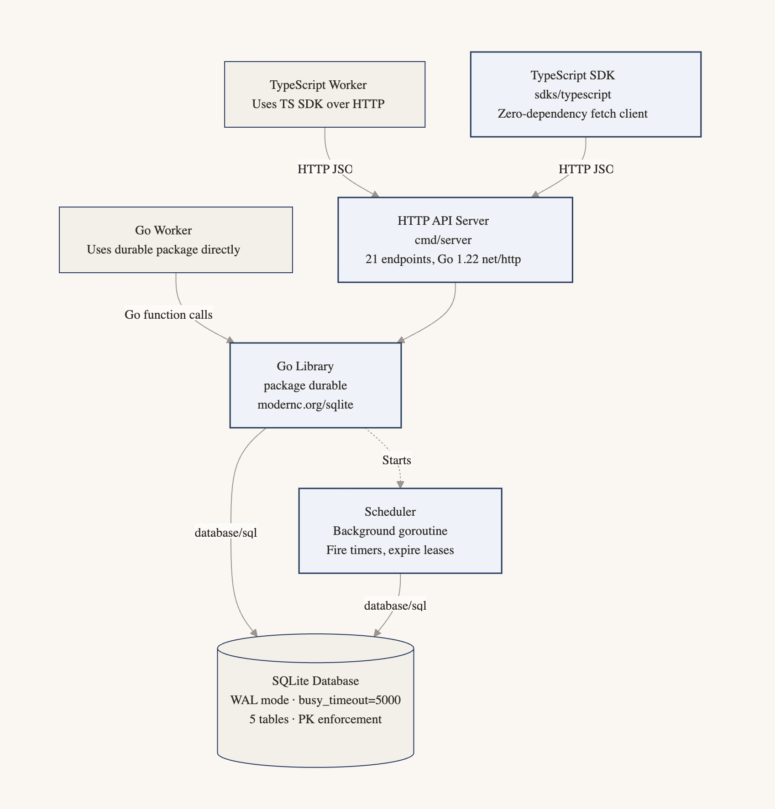

# sqlite-durable-workflow

SQLite-native durable workflow engine for Go. Eliminates the need for a
dedicated orchestration service by using SQLite as the sole source of truth
for workflow execution, persistence, recovery, scheduling, and coordination.

## Design



- **SQLite is the orchestrator** — no external queue, broker, or service
- **Event-sourced** — every state transition is an immutable event
- **Workers are stateless** — crash, restart, scale horizontally
- **Exactly-once checkpointing** — enforced by primary key constraints
- **Automatic recovery** — expired leases and event replay handle failures

## Project structure



## Install (Go library)

```bash
go get github.com/nnn/sqlite-durable-workflow
```

## Quick start (Go library)

```go
import durable "github.com/nnn/sqlite-durable-workflow"

engine, _ := durable.New("workflows.db")
defer engine.Close()

wf, _ := engine.CreateWorkflow("order-123", "order_processing")
wf, _ = engine.AcquireLease("worker-1", 30*time.Second)
engine.CompleteStep(wf.WorkflowID, "worker-1", 1, input, output)
engine.CompleteWorkflow(wf.WorkflowID, "worker-1")
```

Run the full example:

```bash
go run ./cmd/example/
```

## HTTP server

The engine can run as a standalone JSON API server so workers in any language
can participate.

```bash
go run ./cmd/server/ -db workflows.db -addr :8080
```

| Flag | Default | Description |
|---|---|---|
| `-db` | `workflows.db` | Path to SQLite database |
| `-addr` | `:8080` | HTTP listen address |
| `-tick` | `1s` | Scheduler poll interval |
| `-lease` | `30s` | Default lease duration |
| `-api-key` | _(empty)_ | Require `Bearer` token matching this value (empty = no auth) |

### Authentication

When the `-api-key` flag is set, all requests must include an `Authorization` header:

```
Authorization: Bearer <your-api-key>
```

Requests without a valid key receive `401 Unauthorized`.

### Endpoints

| Method | Path | Description |
|---|---|---|
| `POST` | `/workflows` | Create a workflow |
| `GET` | `/workflows/{id}` | Get workflow by ID |
| `POST` | `/workflows/{id}/complete` | Mark workflow COMPLETED |
| `POST` | `/workflows/{id}/fail` | Mark workflow FAILED |
| `POST` | `/workflows/{id}/waiting` | Mark workflow WAITING |
| `POST` | `/leases/acquire` | Acquire next eligible lease |
| `POST` | `/leases/{id}/renew` | Renew lease |
| `POST` | `/leases/{id}/release` | Release lease |
| `POST` | `/steps/start` | Record step start |
| `POST` | `/steps/complete` | Checkpoint completed step |
| `POST` | `/steps/fail` | Record step failure |
| `GET` | `/steps/{id}` | Get all checkpoints |
| `POST` | `/signals` | Send a signal |
| `POST` | `/signals/{id}/consume` | Atomically consume next signal |
| `GET` | `/signals/{id}` | List signals |
| `POST` | `/timers` | Create a timer |
| `POST` | `/retry` | Schedule a retry |
| `GET` | `/events/{id}` | Get event history |
| `GET` | `/observability/failed` | All FAILED workflows |
| `GET` | `/observability/running` | All RUNNING workflows |
| `GET` | `/observability/queued` | All QUEUED workflows |
| `GET` | `/observability/waiting` | All WAITING workflows |
| `GET` | `/observability/avg-step-duration` | Average step duration |

## TypeScript SDK

```bash
cd sdks/typescript
npm install
```

### Quick start (TypeScript)

```ts
import { Client } from "@sqlite-durable-workflow/sdk";

const client = new Client("http://localhost:8080");

// With API key, timeout, and retry
const client = new Client("http://localhost:8080", {
  apiKey: "my-secret-key",
  timeout: 10_000,
  maxRetries: 3,
  retryDelay: 500,
});

// Create a workflow
const wf = await client.createWorkflow("order-123", "order_processing");

// Acquire a lease and execute a step
const claimed = await client.acquireLease({ worker_id: "worker-1" });
if (claimed) {
  await client.completeStep(claimed.workflow_id, "worker-1", 1,
    { order_id: "123" },
    { status: "validated" }
  );
  await client.completeWorkflow(claimed.workflow_id, "worker-1");
}

// Observability
const failed = await client.queryFailed();
const events = await client.getEvents("order-123");
```

### Run the example

```bash
# Terminal 1: start the server
go run ./cmd/server/

# Terminal 2: run the TypeScript example
cd sdks/typescript && npx tsx examples/basic.ts
```

### TypeScript API

| Method | Description |
|---|---|
| `createWorkflow(id, type)` | Create a new QUEUED workflow |
| `getWorkflow(id)` | Fetch a workflow by ID |
| `completeWorkflow(id, worker)` | Mark workflow COMPLETED |
| `failWorkflow(id, worker)` | Mark workflow FAILED |
| `markWaiting(id, worker)` | Pause workflow |
| `acquireLease(cfg)` | Claim next eligible workflow |
| `renewLease(id, cfg)` | Extend lease |
| `releaseLease(id, worker)` | Return to QUEUED |
| `startStep(id, worker, step, input)` | Record step start |
| `completeStep(id, worker, step, input, output)` | Checkpoint completed step |
| `failStep(id, worker, step, input, error)` | Record step failure |
| `getSteps(id)` | Fetch checkpoints |
| `sendSignal(id, type, payload)` | Persist signal |
| `consumeSignal(id)` | Atomically consume next signal |
| `getSignals(id, unconsumedOnly)` | List signals |
| `createTimer(id, wakeAt)` | Schedule a wake-up |
| `retryStep(id, worker, step, count, cfg)` | Schedule retry |
| `getEvents(id)` | Fetch event history |
| `queryFailed()` | All FAILED workflows |
| `queryRunning()` | All RUNNING workflows |
| `queryQueued()` | All QUEUED workflows |
| `queryWaiting()` | All WAITING workflows |
| `avgStepDuration()` | Average step duration |

### TypeScript types

| Type | Description |
|---|---|
| `Workflow` | Workflow record |
| `WorkflowEvent` | Immutable event |
| `WorkflowStep` | Step checkpoint |
| `Signal` | Async signal |
| `Timer` | Scheduled timer |
| `RetryConfig` | Retry configuration (fixed / linear / exponential) |
| `LeaseConfig` | Lease parameters |
| `ClientOptions` | Client config: `apiKey`, `timeout`, `maxRetries`, `retryDelay` |
| `WorkflowStatus` | `"QUEUED" \| "RUNNING" \| "WAITING" \| "COMPLETED" \| "FAILED"` |

## Go API reference

### Engine lifecycle

| Method | Description |
|---|---|
| `New(dbPath) (*Engine, error)` | Open/create database and initialize schema |
| `Close() error` | Close the database |
| `DB() *sql.DB` | Access underlying connection for custom queries |

### Workflows

| Method | Description |
|---|---|
| `CreateWorkflow(id, type) (*Workflow, error)` | Create a new QUEUED workflow |
| `GetWorkflow(id) (*Workflow, error)` | Fetch a workflow by ID |
| `CompleteWorkflow(id, worker) error` | Mark workflow COMPLETED |
| `FailWorkflow(id, worker) error` | Mark workflow FAILED |
| `MarkWaiting(id, worker) error` | Pause workflow (timer/signal wait) |

### Leases

| Method | Description |
|---|---|
| `AcquireLease(worker, duration) (*Workflow, error)` | Claim next eligible workflow |
| `RenewLease(id, worker, duration) error` | Extend lease for long-running work |
| `ReleaseLease(id, worker) error` | Return workflow to QUEUED |

### Step execution

| Method | Description |
|---|---|
| `StartStep(id, worker, step, input) error` | Record step start + STEP_STARTED event |
| `CompleteStep(id, worker, step, input, output) error` | Checkpoint step, advance cursor, emit event |
| `FailStep(id, worker, step, input, err) error` | Record step failure |
| `GetSteps(id) ([]WorkflowStep, error)` | Fetch all checkpoints |

### Signals

| Method | Description |
|---|---|
| `SendSignal(id, type, payload) (*Signal, error)` | Persist async signal |
| `ConsumeSignal(id) (*Signal, error)` | Atomically consume next signal |
| `GetSignals(id, unconsumedOnly) ([]Signal, error)` | List signals |

### Timers

| Method | Description |
|---|---|
| `CreateTimer(id, wakeAt) (*Timer, error)` | Schedule a wake-up |
| `GetPendingTimers(id) ([]Timer, error)` | List unfired timers |

### Retry

| Method | Description |
|---|---|
| `RetryStep(id, worker, step, count, cfg) (bool, error)` | Schedule retry or return false if exhausted |

Built-in backoff policies: `FixedBackoff`, `LinearBackoff`, `ExponentialBackoff`.

### Scheduler

| Method | Description |
|---|---|
| `NewScheduler(engine, interval) *Scheduler` | Create background scheduler |
| `Run(ctx)` | Blocking loop — fire timers, expire leases |
| `Tick()` | Single manual tick (for tests) |

### Observability

| Method | Description |
|---|---|
| `QueryFailed() ([]Workflow, error)` | All FAILED workflows |
| `QueryRunning() ([]Workflow, error)` | All RUNNING workflows |
| `QueryQueued() ([]Workflow, error)` | All QUEUED workflows |
| `QueryWaiting() ([]Workflow, error)` | All WAITING workflows |
| `AvgStepDuration() (map[int]float64, error)` | Average step duration by number |
| `GetEvents(id) ([]WorkflowEvent, error)` | Full event history |

## Architecture

```
   Client (any language)       Client (TypeScript SDK)
         │                            │
         ▼                            ▼
┌─────────────────────────────────────────┐
│           HTTP API server               │
│         (Go, cmd/server)                │
├─────────────────────────────────────────┤
│           Engine (Go library)           │
├─────────────────────────────────────────┤
│           SQLite (WAL mode)             │
└────┬──────────────────────────────┬─────┘
     │                              │
     ▼                              ▼
┌─────────┐                  ┌─────────┐
│ Worker A│                  │ Worker B│
│ (Go)    │                  │ (TS)    │
└─────────┘                  └─────────┘
```

Workers never communicate directly. All coordination happens through SQLite.

## License

MIT
